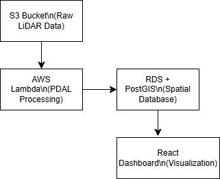

# Architecture Diagram

## Data Flow

1. **S3 Bucket** → Stores raw FMCW LiDAR data
2. **Lambda** → Processes with PDAL, extracts features
3. **RDS/PostGIS** → Stores classified points in spatial database
4. **Dashboard** → React frontend for visualization

## Tech Stack
- PDAL: Point cloud preprocessing
- PostGIS: Spatial database
- Open3D: Feature extraction
- scikit-learn: ML classification
- AWS Lambda: Serverless processing
- AWS RDS: Managed PostgreSQL
- React: Frontend UI
